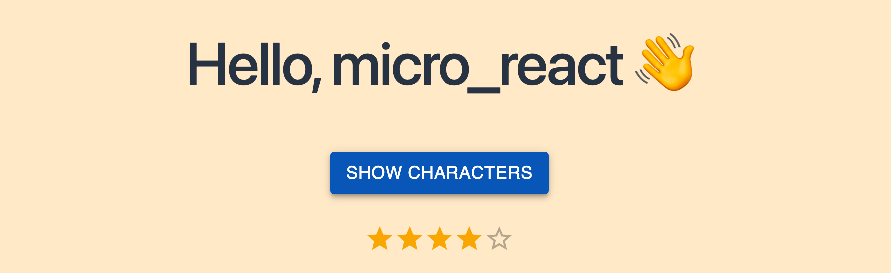
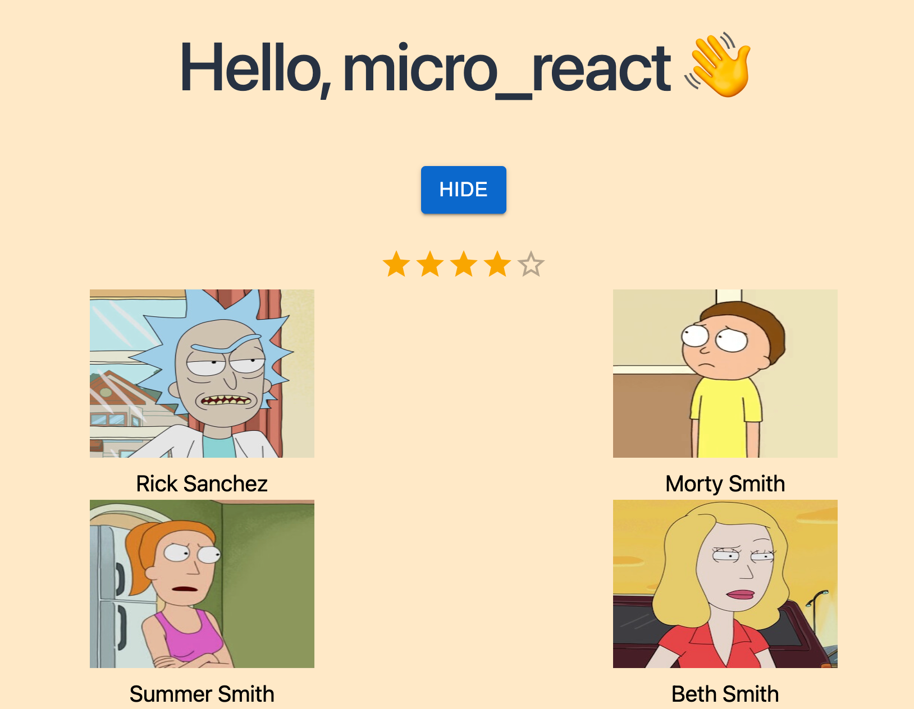

# micro-frontend-react

This example micro frontend app will contain a **container** app and a **micro_react** app

- **container** -- container app contains a mui button
- **micro_react** —- micro_react app using graphQL to fetch characters and mui button for the display toggle

<hr />

Step 1: create monorepo workspace with empty setup named micro-frontend-react and target into it

```jsx
npx create-nx-workspace --preset=empty micro-frontend-react
cd micro-frontend-react
```

Step 2: installing all react dependencies:

```jsx
npm install -D @nrwl/react
```

Step 3: generating container app:

```jsx
nx g @nrwl/react:app container
```

Step 4: generating the micro_react app:

```jsx
nx g @nrwl/react:app micro_react
```

Now you can use 👇 to start each application

```jsx
npx nx serve micro_react
// or
npx nx serve container
```

or change "defaultProject": "..." within "nx.json" and use

```jsx
npm start
```

<hr />

### Configuring micro_react app, add some ui

- To create the common-ui library, use the **@nrwl/react:lib** generator

```jsx
npx nx g @nrwl/react:lib common-ui
```

- To create the fetch hook library, use the **@nrwl/js:lib** generator

```jsx
npx nx g @nrwl/js:lib fetch
```

- Create a banner contains only a button

```jsx
npx nx g @nrwl/react:component banner --project=common-ui --export
```

- Create components

=> those will follow this path: micro-frontend-react/libs/common-ui/src/lib/...

- Add mui packages

```jsx
npm install @mui/material @emotion/react @emotion/styled
```

- Update banner

- Import banner from micro_react/src/app/app.tsx

```jsx
import { Banner } from '@micro-frontend-react/common-ui';
export function App() {
  ...
  return (
    <div className={styles['app_wrapper']}>
      <Banner handleClick={handleClick} showCharacters={showCharacters} />
      <Characters showCharacters={showCharacters} />
    </div>
  );
}
```

### Configuring container app, same as micro_react



