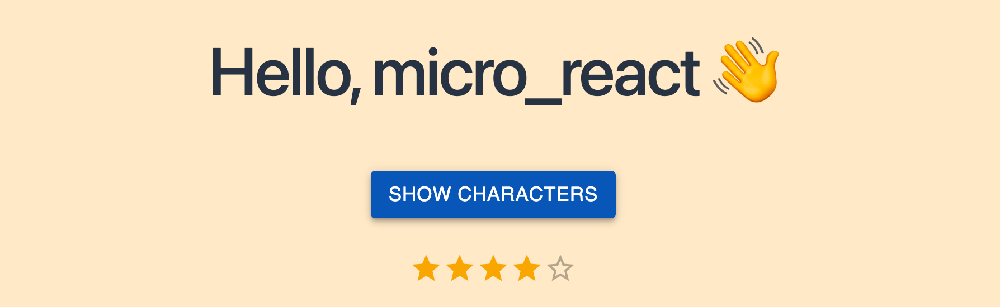
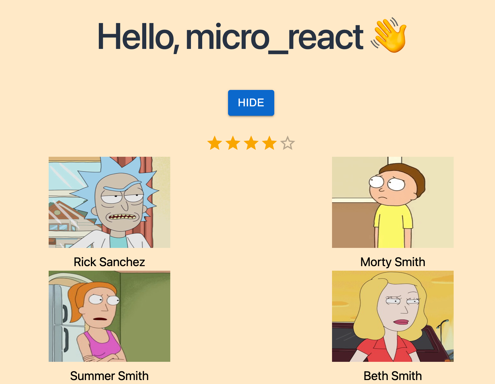
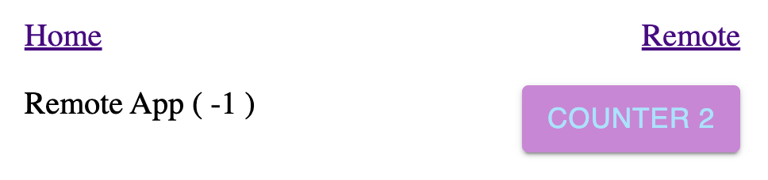
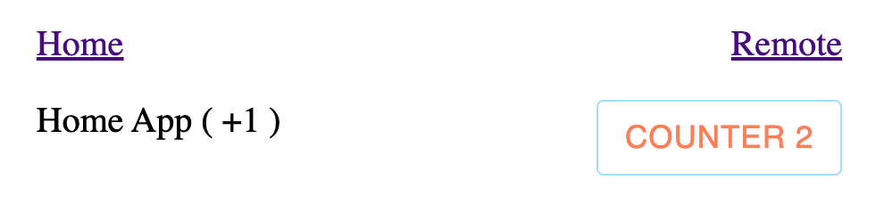
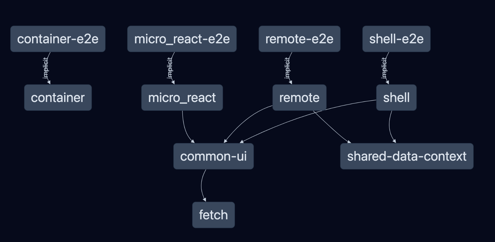

# micro-frontend-react

This example micro frontend app will contain a **container**, a **micro_react** app, a **shell** and a **remote** app

- **container** -- container app contains a mui button
- **micro_react** —- micro_react app using graphQL to fetch characters and mui button for the display toggle
- **shell** and **remote** Apps -- using shared counter context data on button clicks

<hr />

Step 1: create monorepo workspace with empty setup named micro-frontend-react and target into it

```jsx
npx create-nx-workspace --preset=empty micro-frontend-react
cd micro-frontend-react
```

Step 2: installing all react dependencies:

```jsx
npm install -D @nrwl/react
```

<hr />

## container and micro_react React Applications

Step 3: generating container app:

```jsx
nx g @nrwl/react:app container
```

Step 4: generating the micro_react app:

```jsx
nx g @nrwl/react:app micro_react
```

Now you can use 👇 to start each application

```jsx
npx nx serve micro_react
// or
npx nx serve container
```

or change "defaultProject": "..." within "nx.json" and use

```jsx
npm start
```

<hr />

### Configuring micro_react app, add some ui

- To create the common-ui library, use the **@nrwl/react:lib** generator

```jsx
npx nx g @nrwl/react:lib common-ui
```

- To create the fetch hook library, use the **@nrwl/js:lib** generator

```jsx
npx nx g @nrwl/js:lib fetch
```

- Create a banner contains only a button

```jsx
npx nx g @nrwl/react:component banner --project=common-ui --export
```

- Create components

=> those will follow this path: micro-frontend-react/libs/common-ui/src/lib/...

- Add mui packages

```jsx
npm install @mui/material @emotion/react @emotion/styled
```

- Update banner

- Import banner within micro_react/src/app/app.tsx from libs

```jsx
import { Banner } from '@micro-frontend-react/common-ui';
export function App() {
  ...
  return (
    <div className={styles['app_wrapper']}>
      <Banner handleClick={handleClick} showCharacters={showCharacters} />
      <Characters showCharacters={showCharacters} />
    </div>
  );
}
```

### Configuring container app, same as micro_react




<hr />

## **Shell** and **Remote** React applications

- add both Apps

```jsx
nx g @nrwl/react:host shell --remotes=remote
```

Shell and Remote Apps are using shared data which placed in libs/shared/data-context/src/lib/shared-data-context.tsx

- Add shared library

```jsx
nx g @nrwl/react:library shared/data-context
```

- update data-context with counter state

- in libs/shared/data-context/src/index.ts

```jsx
export { DataProvider, DataContext } from './lib/shared-data-context';
```

- update module-federation.config.js in
  apps/shell/module-federation.config.js and apps/remote/module-federation.config.js

```jsx
const coreLibraries = new Set([
  'react',
  'react-dom',
  'react-router-dom',
  '@micro-frontend-react/shared/data-context',
]);
module.exports = {
  name: 'shell',
  remotes: ['remote'],
  shared: (libraryName, defaultConfig) => {
    if (coreLibraries.has(libraryName)) {
      return defaultConfig;
    }
    // Returning false means the library is not shared.
    return false;
  },
};
```

- import data-provider inside Shell/src/app/app.tsx
- consume the counter context state in the Shell and Remote app

```jsx
const { counter, setCounter } = useContext(DataContext);
```

- Run the application ( Shell will be running at localhost 4200, Remote 4210 )

```jsx
nx serve shell --open --devRemotes=remote
```




- Run 👇 to view the projects connection

```jsx
nx graph
```

 
